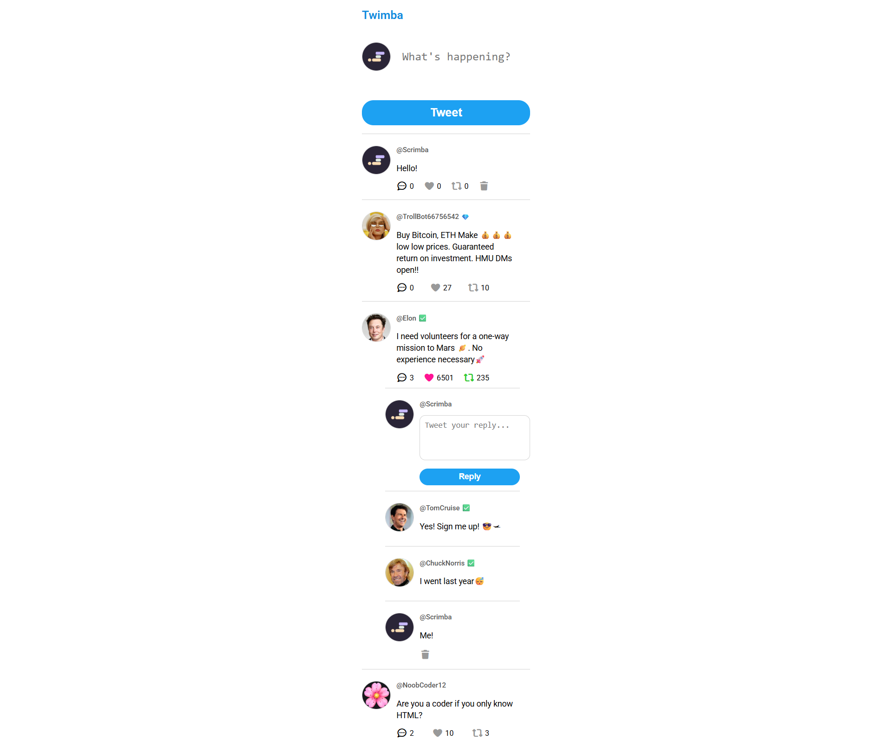

# 🐦 Twimba (Twitter Clone)

A solo project from the [Scrimba Frontend Developer Career Path](https://scrimba.com/frontend-path-c0j).  
Twimba (Twitter + Scrimba) is a mini Twitter clone. Tweets, likes, retweets, and replies are dynamically generated from a JavaScript array, making the feed fully scalable and interactive. Users can post tweets, reply to tweets, like, retweet, and delete their own content.

## 🛠️ Technologies
- HTML5  
- CSS3  
- JavaScript (ES6)

## 🚀 Features
- Dynamically renders tweets from a JavaScript data file.
- Displays user handle, profile picture, tweet text, like count, retweets, and replies.
- Interactive icons for like, retweet, and reply, updated in real time.
- Reply system where users can post responses to any tweet (threaded view).
- Collapsible reply sections for a cleaner feed layout.
- Delete functionality where users can delete only their own tweets and replies.
- Semantic HTML structure with accessible, responsive UI.
- Partial DOM updates where only modified tweets are re-rendered for better performance.

## 🧠 What I Learned / Process
- Practiced **DOM manipulation** and **template rendering** using JavaScript.
- Implemented **event delegation** to handle clicks on dynamic elements efficiently.
- Used **data attributes** to connect UI elements with their underlying tweet data.
- Reinforced understanding of array methods like `.map()`, `.filter()`, `.forEach()`, `.find()`, and `.findIndex()`.
- Implemented **reply threading**, where each tweet maintains its own nested list of replies.
- Learned to create **reusable UI components** (`createTweetHtml()`, `updateTweetDom()`) for cleaner, maintainable code.
- Improved code scalability and performance using **partial DOM rendering**.

## 💡 Future Improvements
- Save tweets, likes, retweets, and replies to localStorage so that data persists on reload.
- Add tweet editing functionality for the current user.
- Introduce multiple user profiles or login simulation, allowing switching between different users.
- Timestamp feature, showing when tweets and replies were created.
- Add a dark/light mode toggle.
- Improve responsive design for mobile users.
  
## 🖼️ Preview

## 📚 Sources & References
- Scrimba course: [Scrimba Frontend Developer Career Path](https://scrimba.com/frontend-path-c0j)
- Icons: [Font Awesome](https://fontawesome.com/)
